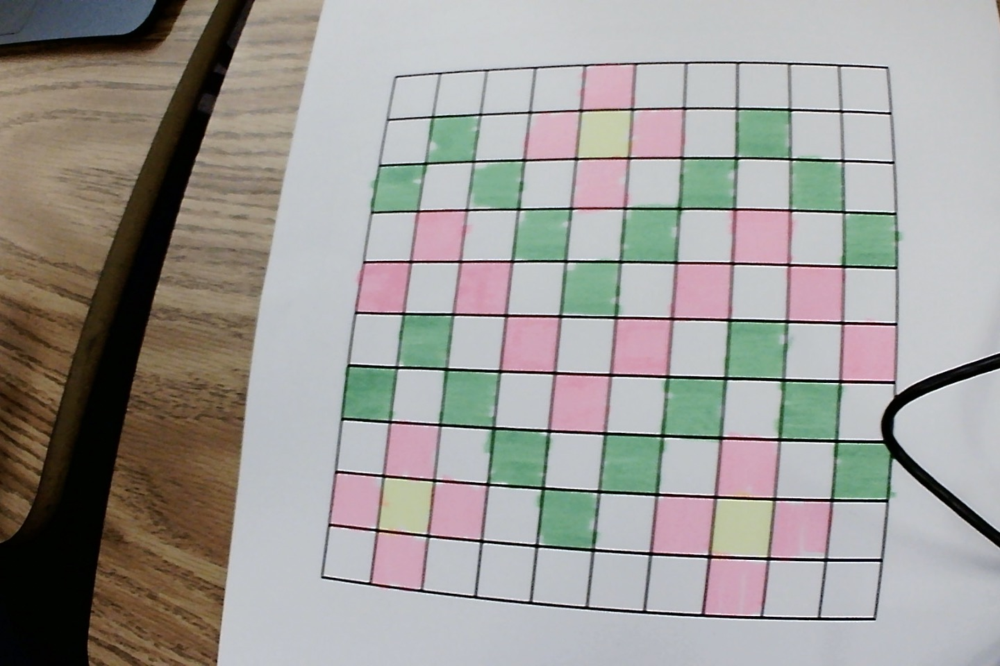
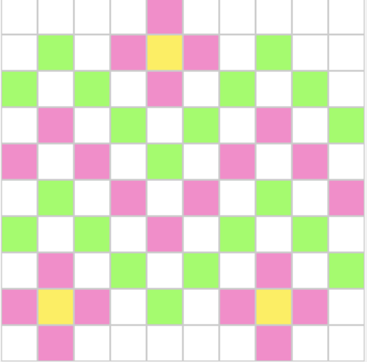

# Pixel art with Hexadecimals

A 10 by 10 pixel grid made on paper and then with hexadecimals

## Papers

## Pixels

Here is the binary that makes this pixel art in case you want to make it yourself, but I recommend using the hexadecimal system.

111111111111111111111111 111111111111111111111111 111111111111111111111111 111111111111111111111111 111111111000100011001100 111111111111111111111111 111111111111111111111111 111111111111111111111111 111111111111111111111111 111111111111111111111111 
111111111111111111111111 100010001111111001010101 111111111111111111111111 111111111000100011001100 111111101110111001000100 111111111000100011001100 111111111111111111111111 100010001111111001010101 111111111111111111111111 111111111111111111111111 
100010001111111001010101 111111111111111111111111 100010001111111001010101 111111111111111111111111 111111111000100011001100 111111111111111111111111 100010001111111001010101 111111111111111111111111 100010001111111001010101 111111111111111111111111 
111111111111111111111111 111111111000100011001100 111111111111111111111111 100010001111111001010101 111111111111111111111111 100010001111111001010101 111111111111111111111111 111111111000100011001100 111111111111111111111111 100010001111111001010101 
111111111000100011001100 111111111111111111111111 111111111000100011001100 111111111111111111111111 100010001111111001010101 111111111111111111111111 111111111000100011001100 111111111111111111111111 111111111000100011001100 111111111111111111111111 
111111111111111111111111 100010001111111001010101 111111111111111111111111 111111111000100011001100 111111111111111111111111 111111111000100011001100 111111111111111111111111 100010001111111001010101 111111111111111111111111 111111111000100011001100 
100010001111111001010101 111111111111111111111111 100010001111111001010101 111111111111111111111111 111111111000100011001100 111111111111111111111111 100010001111111001010101 111111111111111111111111 100010001111111001010101 111111111111111111111111 
111111111111111111111111 111111111000100011001100 111111111111111111111111 100010001111111001010101 111111111111111111111111 100010001111111001010101 111111111111111111111111 111111111000100011001100 111111111111111111111111 100010001111111001010101 
111111111000100011001100 111111101110111001000100 111111111000100011001100 111111111111111111111111 100010001111111001010101 111111111111111111111111 111111111000100011001100 111111101110111001000100 111111111000100011001100 111111111111111111111111 
111111111111111111111111 111111111000100011001100 111111111111111111111111 111111111111111111111111 111111111111111111111111 111111111111111111111111 111111111111111111111111 111111111000100011001100 111111111111111111111111 111111111111111111111111 

